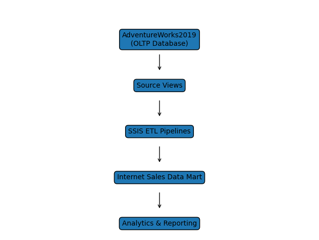
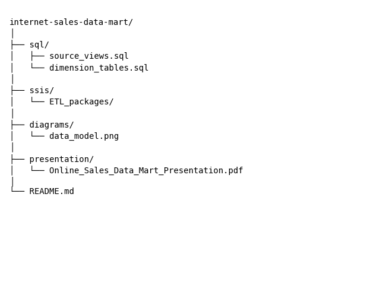

# AdventureWorks Internet Sales Data Mart - SQL Server Data Warehousing Project
## Project Overview

This project demonstrates the design and implementation of a traditional **data warehouse data mart** using the **Microsoft SQL Server BI stack**.

Using the **AdventureWorks2019 OLTP database** as the source system, I designed and built an **Internet Sales Data Mart** that supports analytical reporting and business intelligence for online sales performance.

The project covers the complete **data warehousing workflow**, including:

- Dimensional data modeling  
- Source-to-target data mapping  
- ETL pipeline development using SSIS  
- Data transformation and cleansing  
- Slowly Changing Dimension (SCD) implementation  
- Data validation and quality checks  

This project simulates a real-world **enterprise data warehouse development process**.

---

# Business Problem

Adventure Works Cycles is a multinational bicycle manufacturer with two major revenue channels:

- Internet Sales  
- Reseller Sales  

To support enterprise-level reporting and analytics, management requires a centralized data warehouse to integrate sales data and enable efficient analysis.

This project focuses on building an **Internet Sales Data Mart** to support analytical queries and reporting related to online sales performance.

---

# Tools & Technologies

- Microsoft SQL Server
- SQL Server Management Studio (SSMS)
- Visual Studio
- SQL Server Integration Services (SSIS)
- T-SQL
- Microsoft Excel
- Dimensional Data Modeling
- Data Warehousing ETL Design

---

# Data Architecture

The project follows a typical **OLTP → ETL → Data Warehouse** architecture.

---

# Data Model

The Internet Sales Data Mart uses a **dimensional model** consisting of a fact table and multiple dimension tables.

### Fact Table

- FactInternetSales

### Dimension Tables

- DimCustomer  
- DimProduct  
- DimProductCategory  
- DimProductSubcategory  
- DimDate  
- DimCurrency  
- DimGeography  
- DimPromotion  
- DimSalesTerritory  

The model enables efficient querying for analytical workloads such as sales trends, product performance, and customer segmentation.

---

# ETL Process

ETL pipelines were developed using **SQL Server Integration Services (SSIS)**.

### Key ETL Steps

1. Extract data from the **AdventureWorks2019 source database**
2. Create **SQL views** to facilitate [source-to-target mapping](excel/Source_to_Target_Mapping.xlsx)
3. Transform and clean data during the ETL process
4. Load dimension tables
5. Implement **Slowly Changing Dimension (SCD Type 2)** for product history tracking
6. Load the **FactInternetSales** table
7. Perform **data validation checks** to ensure data accuracy

---

# Data Transformation Highlights

The ETL pipelines include several important transformations:

- Duplicate record removal using **Sort transformation**
- Data enrichment using **external CSV data**
- **Lookup transformations** to retrieve foreign keys
- **Merge Join transformation** for combining datasets
- Implementation of **Slowly Changing Dimension Type 2** for historical tracking
- Validation against the original **AdventureWorksDW2019** data warehouse

---

# Data Loading Results

| Table | Rows Loaded |
|------|-------------|
| DimCustomer | 18484 |
| DimProduct | 504 |
| DimDate | 2,922 |
| DimGeography | 655 |
| DimCurrency | 105 |
| DimPromotion | 16 |
| FactInternetSales | 60,398 |

These results confirm that the ETL pipelines successfully loaded and validated the data mart tables.

---

# Repository Structure

---

# Project Presentation

A detailed presentation explaining the **data warehouse design, ETL process, and validation steps** is included in this repository:

📄 **Online Sales Data Mart Project Presentation (PDF)**

---

# Key Skills Demonstrated

- Data warehouse design
- Dimensional modeling (fact and dimension tables)
- ETL pipeline development using SSIS
- Data transformation and cleansing
- Slowly Changing Dimension (SCD Type 2)
- Data validation and quality assurance
- SQL Server data integration

---

# Learning Outcomes

Through this project, I gained hands-on experience with:

- Designing dimensional models for analytical systems
- Building ETL pipelines using the Microsoft BI stack
- Implementing historical tracking using SCD Type 2
- Performing source-to-target data mapping
- Ensuring data quality and validation in data warehouse environments

---

# Author

**Gang Huo**

Data Analyst | Business Intelligence Analyst  
Specializing in **SQL, Data Warehousing, ETL Development, and BI Reporting**

For inquiries, feel free to contact me at  
[huogang.ca@gmail.com](mailto:huogang.ca@gmail.com)